## About

This website demonstrates the most common responsive patterns. The site is
intended for educational purposes only.

The site lives here: https://pictureelement.github.io/responsive-patterns/

## Page Samples

### Column Drop

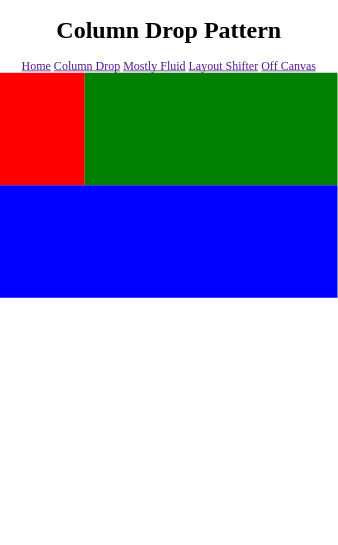
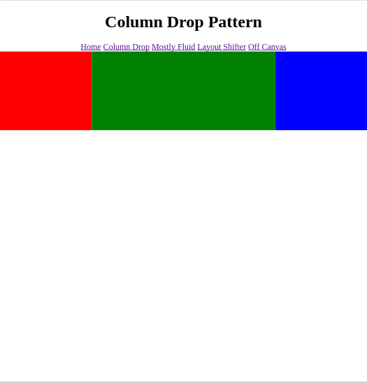

### Mostly Fluid

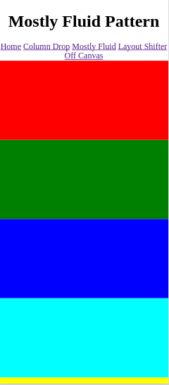
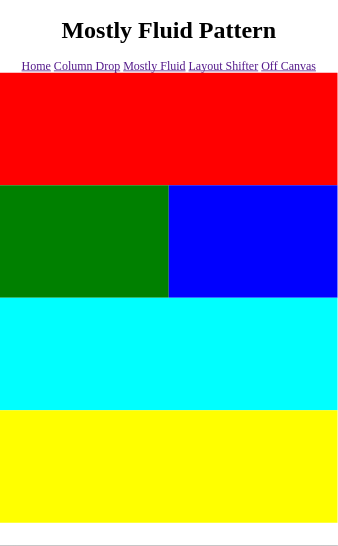
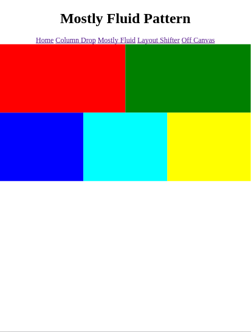
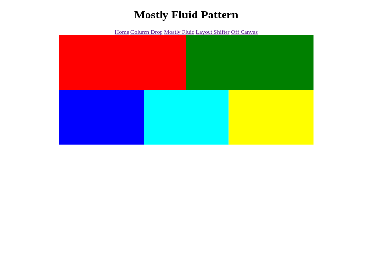

### Layout Shifter

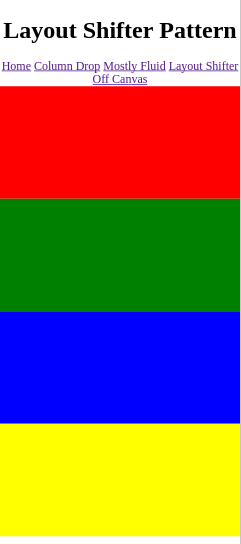
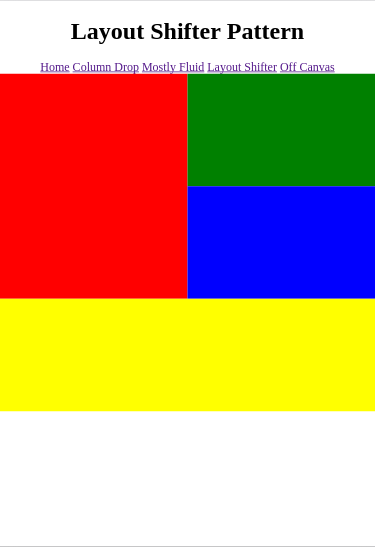
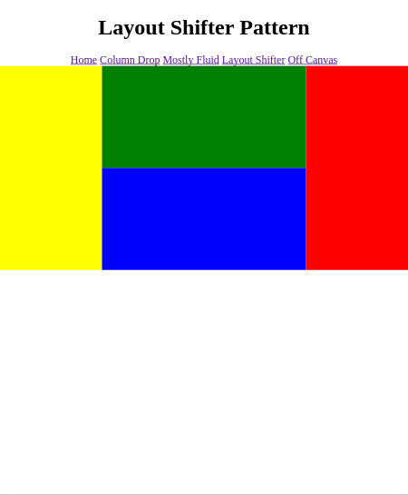

### Off Canvas

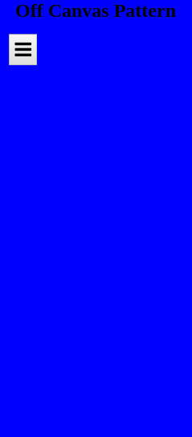
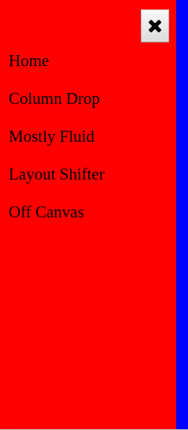
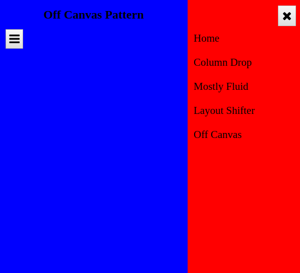

## Copyright

&copy; 2017 Marios Sofokleous

Feel free to do anything with the code.